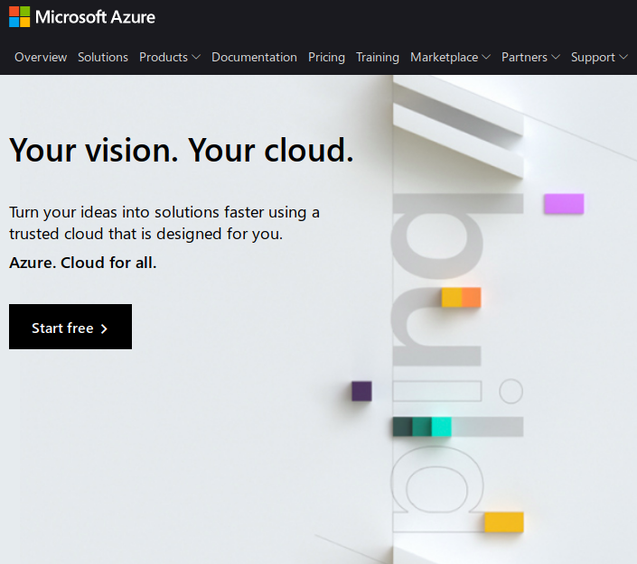
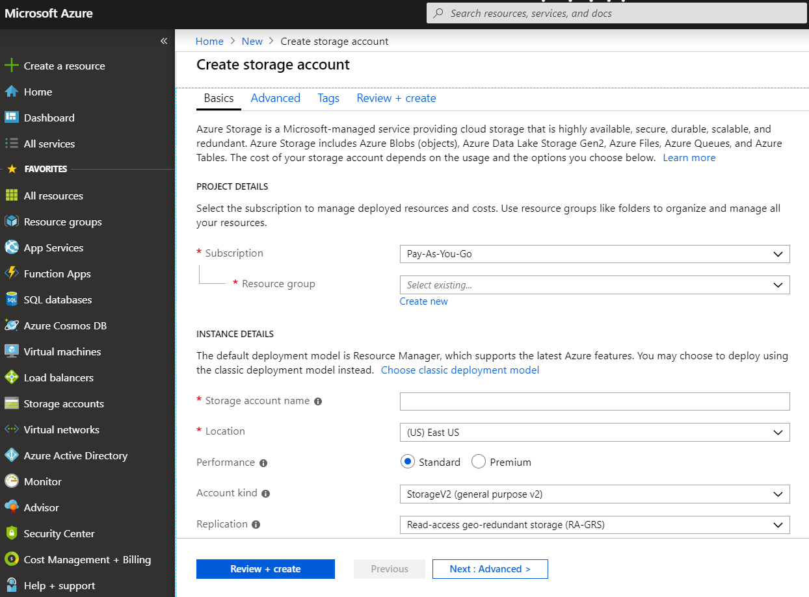

# Microsoft Cloud Computing Service

## Azure

Microsoft Azure (formerly Windows Azure) is a cloud computing service created by
Microsoft for building, testing, deploying, and managing applications and
services through Microsoft-managed data centers.

Azure has over 600 services, inclding compute, mobile sevice, storage service,
data management, messaging and so on. In this case, Azure itself is a
multi-functional platform. As for the compute service, which is the core part
for cloud computing, it provides virtual machines allowing users to launch
general-purpose Microsoft Windows and Linux virtual machines, as well as
preconfigured machine images for popular software packages. The app services
environment lets developers easily publish and manage websites. Azure provides
all its services to users based on website, so users do not need to install any
kind of software in order to implement cloud computing or use other services;

## Azure Account

You can choose either using your outlook email address to create a free trial
account including $200 credit and free access to most popular Azure products for
12 months, or using your euducational email adress to create a student account
including $100 credit.

If you want to create an azure account using your outlook email, you can go to
the next site after creating an outlook email address:

<https://azure.microsoft.com/en-us/>

Then you need to click the Start Free button showing in the next figure. By
entering all required information, your account will be set up. However, the
account will only be available for 30 days. After 30 days, you can continue
using your free products after you upgrade your account to a pay-as-you-go Azure
subscription.



If you want to create an azure account using your educational email, you can go
to the next site if you already have an .edu email address:

<https://azure.microsoft.com/en-us/free/students/>

Then you need to click the Activate now button showing in the next figure. By
entering all required information, your account will be set up. If you use up
all credits, you also need to upgrade your account to a pay-as-you-go Azure
subscription to continue using other services.


To continue to use azure services after 30 days, you need to upgrade your
account to a pay-as-you-go Azure subscription. In this case, you need to provide
your information related to your credit card to complete the upgrade steps. Go
to the next link and lick on Purchases now:

<https://azure.microsoft.com/en-us/offers/ms-azr-0003p/>

##Azure CLI

The Azure CLI is a command-line tool providing a great experience for managing
Azure resources. You can access all azure servies by just typing command on your
local shell.

Before you begin to use this tool to communicate with azure, you first need to
install Azure CLI on your own computer. The next link provide steps in greate
detail about how to install it on Windows, macOS and Ubuntu system.

<https://docs.microsoft.com/en-us/cli/azure/install-azure-cli?view=azure-cli-latest>

Here I will use Ubuntu system as an example to install Azure CLI. First you need
to check if you have installed curl by typing the next command in your shell:

```python
$ curl --version
```

If no error returns, you have successfully installed curl already. Otherwise,
you need to run the next command to install curl first. After finishing, you are
able to run the former command to check if you have installed curl successfully.

```python
$ sudo apt-get update
$ sudo apt-get install curl
```

The Azure CLI offers and maintains a script which runs all of the installation
commands in one step. You just need to run the next command as superuser:

```python
$ curl -sL https://aka.ms/InstallAzureCLIDeb | sudo bash
```

When the installation is finished, you can test your az command by trying to use
it to connect to your azure account. Type the next command in your bash:

```python
$ az login
```

If the CLI can open your default browser, it will do so and load a sign-in
page.Otherwise, you need to open a browser page and follow the instructions on
the command line to enter an authorization code after navigating to
<https://aka.ms/devicelogin> in your browser. After doing that, you need to sign
in with your account credentials in the browser.

Once all these steps are done correctly, then we can use the Azure CLI interface
to connect to our Azure account and manage our virutal machine.


## References

* <https://docs.microsoft.com/en-us/cli/azure/install-azure-cli-apt?view=azure-cli-latest>
* <https://docs.microsoft.com/en-us/cli/azure/?view=azure-cli-latest>
* <https://www.luminanetworks.com/docs-lsc-610/Topics/SDN_Controller_Software_Installation_Guide/Appendix/Installing_cURL_for_Ubuntu_1.html>
* <https://azure.microsoft.com/en-us/>


# Azure Blob Storage and Account Creation

## Azure Blob Storage

Azure Storage is Microsoft's cloud storage solution for modern data 
storage scenarios. Azure Blob storage is Microsoft's object storage 
solution for the cloud. Blob storage is optimized for storing massive 
amounts of data. 

Blob storage offers three types of resources:

* The storage account
* A container in the storage account
* A blob in a container

## Azure Storage account creation

Following are the steps to create Azure storage account

* Prerequisites

  Create a free Azure cloud services subscirption account.

* Log in to the [Azure Portal](https://portal.azure.com/).

{#fig:az-portal}

* In the Azure portal, click on `Create a resource` on the top left corner.

{#fig:az-resource}

* Select `Storage Account` from the options shown

{#fig:az-account}

* Select the subscription in which to create the storage account.

* Under the `Resource group` field, select Create new. Enter a name for your 
  new resource group.
  
* Next, enter a name for your storage account.

* Select a `location` for your storage account, or use the default location.

* Select `create`

After the completion of above steps, Azure blob storage service will be ready 
for use. As a first step, a `Container` should be created in the Blob storage. 
A container organizes a set of blobs, similar to a directory in a file system. 
A default `Container` should be set in the `cloudmesh4.yaml` file, details  of 
which are outlined 
[here](https://github.com/cloudmesh/cloudmesh-manual/blob/master/docs-source/source/configuration/configuration.md)

**IMPORTANT NOTE:**

The free Azure account needs to be upgrade to a pay-as-you-go subscription 
after first 30 days to get continued access to free products—some for the 
first 12 months.

Refer to more details here - <https://azure.microsoft.com/en-us/free/>

## References

* <https://docs.microsoft.com/en-us/azure/storage/common/storage-introduction>

* <https://docs.microsoft.com/en-us/azure/storage/blobs/storage-blobs-overview>


