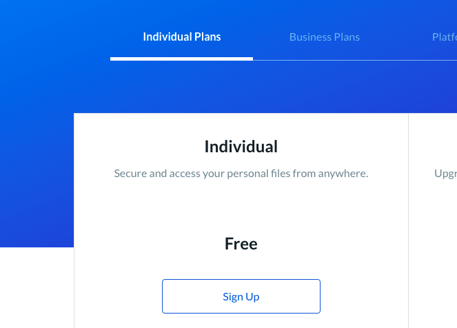
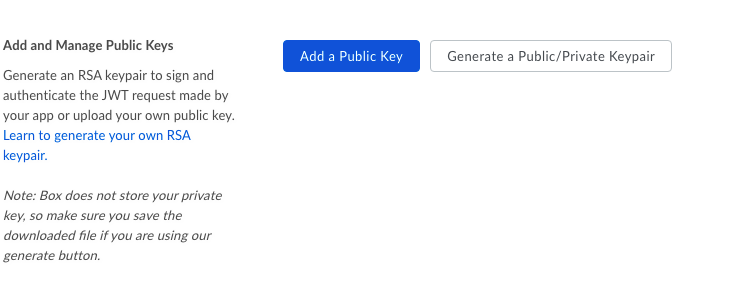

# Setting Up Your Box Account
## Sign up
In the top right hand corner of the box [homepage](https://www.box.com/home) click on the `Get Started` button. 

From the plans page, select the `Individual` tab and then click on the free option. 

Fill out the required information and click `Submit`. You will receive a confirmation email with a link to verify your account. 

Once you have verified your account and signed in, you will be taken to a page that asks you about how you are using Box. You may fill this out or click `Skip this and go straight to Box` below the `Next` button.

## Creating an app

Navigate to the [developer console](https://app.box.com/developers/console) and select `Create New App`.  You will need to select what type of application you are building and an authentication method for your app and then enter an app name (you can change this later). Once your app has been created, click View App. You will then need to click the profile button in the top right corner of the page, and go to `Account Settings`. Scroll down to the Authentication section and click `Require 2-step verification for unrecognized logins`, then follow the prompts.

The following examples have been adapted from <https://developer.box.com/reference>.

### Authentication with JWT

In the Configuration panel of the Developer Console, scroll down to
the section titled `Add and Manage Public Keys` and click `Generate a
Public/Private Keypair`:

Once you have generated a keypair, a config.json file will
automatically download. Save this file in a secure location as you
will need it for authentication purposes. 
