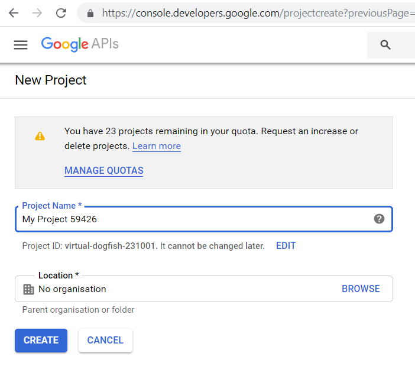
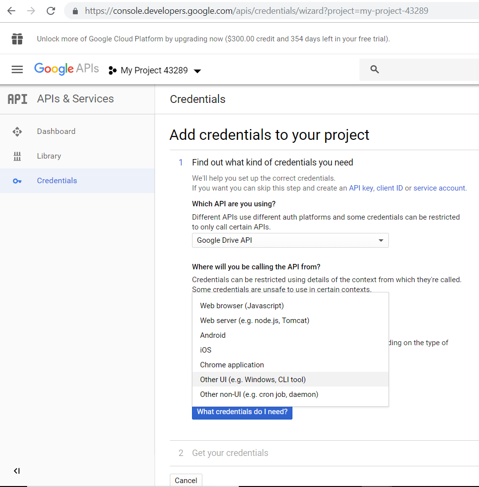
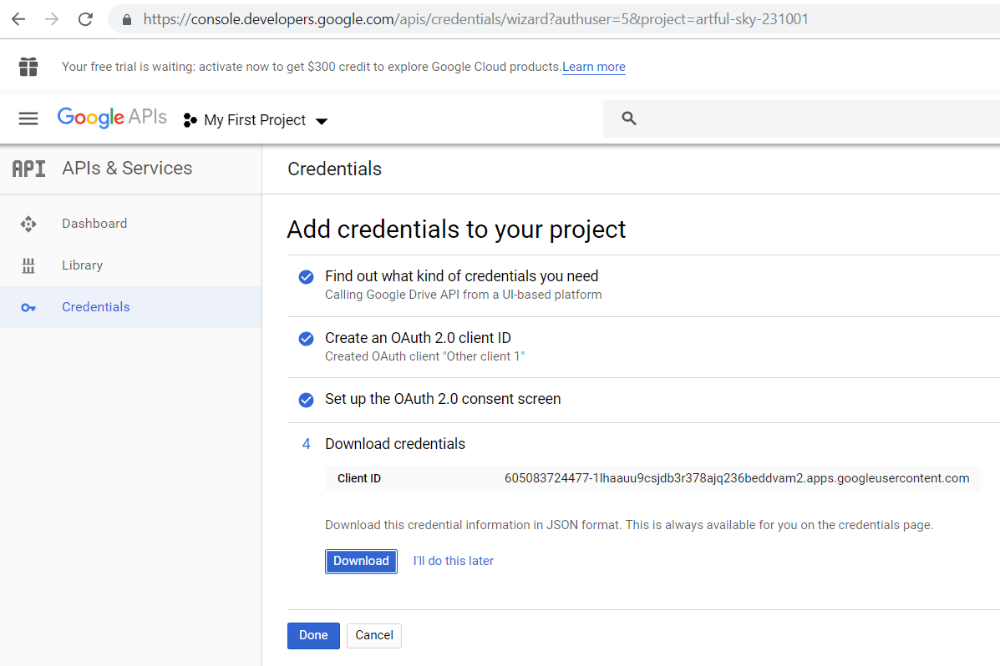

# Google Storage Providers

## Google Drive

Google Drive is a file storing platform where an user can store all his/her
files in the google drive. Here files  can be of any form ranging from
documents to audio / video or image files. In free account each user will be   given around 15 GB of free data space to be stored. We can create folders and
subfolders in the Google Drive  to store our data. 
 
Each file will be stored in Google cloud with a unique URL and it’s up to the
user to make the file  sharable or not. Google Drive is reliable and if an
user has different devices and if he/she wants to access  those files then
Google Drive is needed in this case as he can have access to his file as all his
files  are stored in the cloud. The user does not need to install any kind
of software in order to view these files.
  
   
## Google Docs

Google docs is especially designed for viewing or editing or sharing the
documents like Docs, Sheets,  Slides, Forms. No need to install any
software to access or edit these. And google doc can be sharable with 
editable option. There is an automatic mechanism to convert Microsoft documents
to Google Docs. 

* **Google Docs:** Google docs is a broader term for Google sheets, Google slides
  and Google forms. 

* **Google Sheets:** Just like Microsoft excel sheet Google sheets has almost all
  of the functionalities.  Google sheets can be shared with other people
  and can concurrently work on it and can edit it. We can change  the font
  size, type as we want. We can use the formulas to calculate some mathematical
  expressions. This can be  readily transformed to `.csv` or `.xlsx` format.

* **Google Slides:** Just like Microsoft PowerPoint presentation, Google has
  Googleslides. We can do small  animations, transformations of slides.
  This can be shared with other people to edit this on real time basis.  
  We can change the font size, type of these as we want. 

* **Google Forms:** Out of all Google docs this is the most powerful tool when
  anyone wants to collect data from other people. One can make a Google form and
  can share it via the link. The one who opens this link will see a form to fill.
  We can add many different types of survey questions with multiple choice or
  Multiple options, or text entries or date entries or choose from a list entry.
  This google forms can be used to conduct surveys within a close group like
  teachers, students or employees.

**In a broader sense Google docs is just a subset of Google Drive**  

## Python Google Drive API

### Step-by-step process 

Before writing the Python interface for Google Drive, we need to setup an email
account, with that email  account we will get a set of google services and
one of them is Google Drive with 15 GB overall storage. 

After that we need to go through the Google Drive Quick start guide:

<https://developers.google.com/drive/api/v3/quickstart/python >  

There we can see Enable API option as shown in the next picture:  

Once we enable that we will get credentials.json file where all of our
credentials are stored that can be used  to communicate with our Google
Drive through Python Interface.  After that, we will be redirected to a
page where we need to create our own project as shown in the next picture:

As we see next we need to select Google Drive API from here   

After that, we need to obtain the client_secret file as shown next: (The
file that is downloaded as client_id.json needs to be renamed as
client_secret.json)  

After this we need to click Done otherwise it would not set the Google Drive API

After this if we run Authentication.py we will be redirected to our default
browser to put our our login id and password and  after that it asks to
authenticate our credentials. If we allow that as shown next:  

We will get the screen something like given next (as the authentication
pipeline has bees completed).  

If the authentication flow is completed then the Authentication.py will create a
`google-drive-credentials.json` file in  `.credentials` folder. This file
can be used for future purposes. If we delete this file then the
`Authentication.py`  will again ask for login id and password and again
create that file automatically.  

**So, now with the `client_secret.json`, 
`google-drive-credentials.json`
and with `Authentication.py` and `Provider.py` our setup is ready**

Once all these steps are done correctly, then we can use the Python program
interface to transfer the files  between our Python program and Google
Drive.

## References

* <https://www.cloudwards.net/how-does-google-drive-work/>
* <https://whatis.techtarget.com/definition/Google-Docs>
* <https://www.techopedia.com/definition/13626/google-docs> 
* <https://www.technokids.com/blog/apps/reasons-to-use-google-forms-with-your-students/> 
* <https://developers.google.com/drive/api/v3/quickstart/python>
* <https://github.com/samlopezf/google-drive-api-tutorial>
* <https://developers.google.com/drive/api/v3/manage-uploads> 

